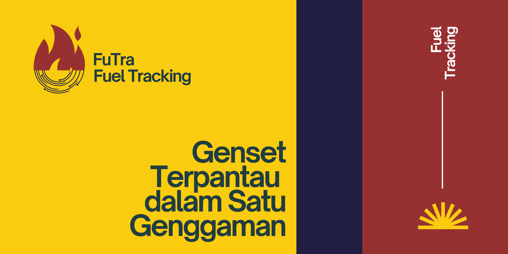
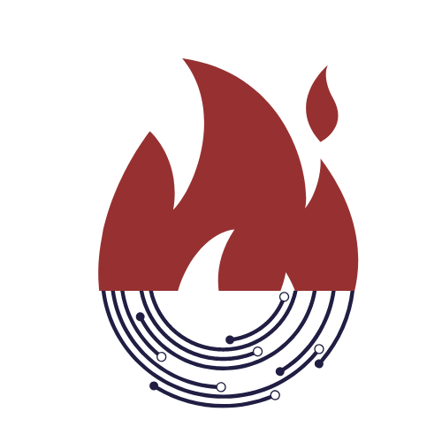
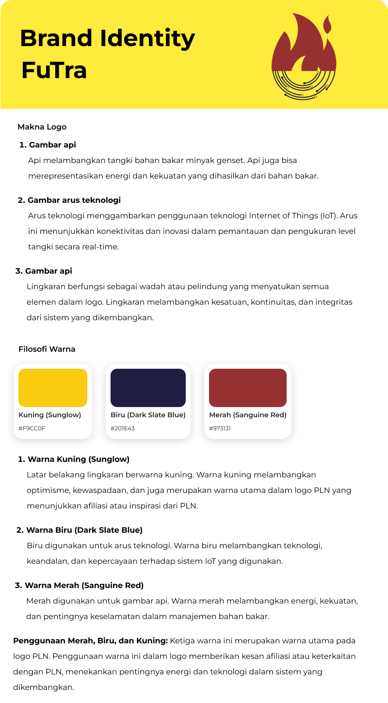
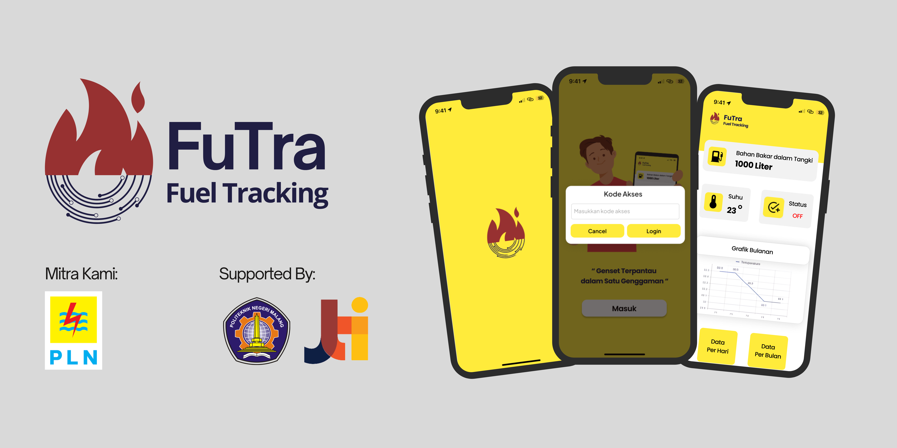

# FUEL- TRACKING

## RANCANG BANGUN ALAT MONITORING UNTUK MENGUKUR LEVEL PADA TANGKI BAHAN BAKAR MINYAK GENSET BERBABIS IOT DI UP2B JAWA TIMUR

  

### Nama Anggota Kelompok :
- Alvian Nur Firdaus (2141720022)
- Yasmine Navisha Andhani (2141720047)
- Yuliyana Rahmawati (2141720241)

***

### Pendahuluan
Pada Project Magang ini mahasiswa polinema akan menggunakan nama "FuTra" yaitu kepanjangan dari Fuel Tracking. FuTra(Fuel Tracking) adalah alat monitoring tangki, suhu dan status genset secara otomatis.

Berikut adalah Logo dan Makna Logo dari FuTra
  
  

***
### Perancangan Desain di Figma

<a href='https://www.figma.com/design/LWq9EznqtFxKL5pJ28OuXC/Monitoring-ESP32?node-id=66-229&t=4PsG7yersFGnO9QF-0'> Desain UI</a>

  

### Penutup 

copyright mahasiswa polinema @2024